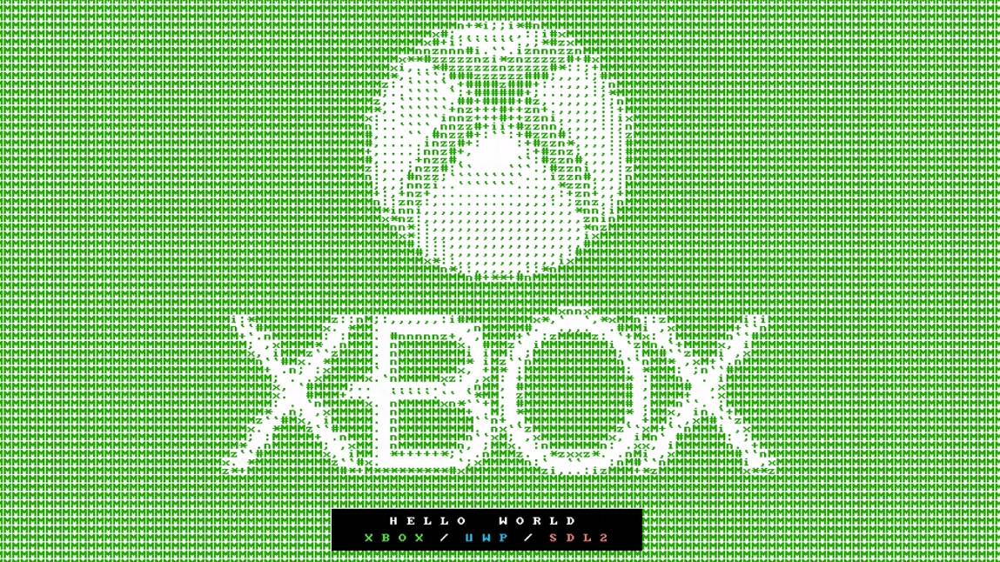

# Xbox UWP SDL2 Starter Project

This is a (mostly) blank Visual Studio solution which has been set up for building UWP apps using C# and SDL2 for the Microsoft Xbox One game console.

While getting a Hello World up and running on an Xbox One is quick and easy using Visual Studio, it assumes you'll be building a GUI app using Windows Presentation Foundation (WPF). This means using XAML to build out screens using controls and widgets. If you want to build a game instead of write an app, this is less than ideal. When building a game you probably want to render to the screen yourself.

I built this starter project because I want to be able to build and port games to the Xbox using C# and the SDL2 library. It took many hours of Googling to find the correct incantations and hidden settings to get this working, so I figured I would document it here for others trying to accomplish the same thing.

You can either clone this repository or download a ZIP file from the [releases](https://github.com/Justin-Credible/xbox-uwp-sdl2-starter/releases) section. Inside you'll find a solution file and C# project with some boilerplate code used to bypass WPF/XAML, initialize SDL, and render a Hello World message.

Much of this information was pieced together starting from this [issue](https://github.com/flibitijibibo/SDL2-CS/issues/114) on the SDL2-CS project piecing together details from the [FNA project](https://fna-xna.github.io/).

## How to use

You can download a ZIP of this starter project from the [releases](https://github.com/Justin-Credible/xbox-uwp-sdl2-starter/releases) page. It will come bundled with everything you need (including a `SDL2.dll` pre-built for the WinRT platform).

You'll need Visual Studio 2019 and an Xbox setup in dev mode. See below for more details. Once you've got your Xbox in dev mode, follow the instructions below to set a signing certificate and enter the IP of your address box to deploy and run.

1. [Download Release](https://github.com/Justin-Credible/xbox-uwp-sdl2-starter/releases)
2. Unzip file
3. Open `xbox-uwp-sdl2-starter.sln`
4. Right click the project file `xbox-uwp-sdl2-starter (Universal Windows)` in the Solution Explorer and select Properties
5. Navigate to Application > Package Manifest > Packaging
6. Click Choose Certificate
7. Either choose an existing certificate or generate a new one
8. Save and close the manifest
9. Back in the project properties, navigate to Debug
10. Ensure Configuration is set to `Debug` and platform `x64`
11. Under Start Options, set Authentication Mode to `Universal (Unencrypted Protocol)` and enter the IP address of your Xbox (displayed on the dev mode dashboard)
12. Click the green play button `Remote Machine` to build, deploy, and run the app on the Xbox!

## Misc Notes

There are several different technologies involved here. Below are some of the issues I ran into.

### Xbox

You'll need an Xbox One game console. All consoles support a development mode, which you can read more about [here](https://docs.microsoft.com/en-us/windows/uwp/xbox-apps/).

You can download the [DevMode activation app](https://docs.microsoft.com/en-us/windows/uwp/xbox-apps/devkit-activation) to your console via the Microsoft Store. This app will walk you through linking your Xbox to your development account. I had to register as an app developer which had a one time fee of $19 USD.

Once registered the DevMode app is supposed to then allow you to reboot into DevMode. **This didn't work for me, and the app just got stuck. Luckily you don't actually need the app for the last step.** Instead go to Settings > System > Console Info. Once there quicly press LB, RB, LT, RT and `Developer settings` should appear. Select this option and you should have another option to enable and reboot into DevMode.

### Visual Studio

I used Visual Studio 2019, though older versions might also work. You'll need to use the Visual Studio installer to make sure you have the `Universal Windows Platform development` and `Windows 10 SDK 10.0.18362.0` features enabled.

The Windows 10 SDK version will change in the future, so it may be newer. Also note that this starter project is targeting `Windows 10, version 1903 (10.0; Build 18362)` (Project Properties > Application) which might also need to be changed in the future.

If you run into issues while deploying **make sure you have a test account setup in DevMode**. There is a widget on the DevMode home screen called `Test accounts`. The add/create buttons were always disabled for me. Instead, I had to go to `Launch Home` and sign in with my real Xbox live account. Then back on the DevMode Home my test account showed up.

### SDL2

SDL2 is written in C and therefore you'll need a wrapper if you plan to write your code in C#. I've include these wrappers from the [SDL2-CS](https://github.com/flibitijibibo/SDL2-CS) project in the `src/xbox-uwp-sdl2-starter/SDL2-CS` directory. You should consider updating these files in your project.

Additionally, you'll need the actual [SDL2](https://www.libsdl.org/) library itself. Again, since it's written in C, it will compile to a native code `SDL2.dll` file. If you download the starter project ZIP from the releases page, I've already built and bundled this file. However, you should consider updating it to get bug fixes and take advantage of new features.

If you are using the repository directly or you want to build `SDL2.dll` it for yourself, you'll need to [obtain the source code](https://www.libsdl.org/download-2.0.php) and use Visual Studio to open the `VisualC-WinRT/UWP_VS2015/SDL-UWP.sln` solution and build an **x64 release** version. The built DLL should be placed into the starter project at `src/xbox-uwp-sdl2-starter/SDL2.dll`.

The DLL is included in the starter project with a `Build Action` of `Content` and `Copy to output directory` of `Always`. This ensures the DLL is bundled into the UWP app package and deployed to the Xbox.

### Removing XAML components

As mentioned earlier, the default UWP project that Visual Studio creates assumes you want to use WPF/XAML to build your app. We don't want these when using SDL2 however. I was able to stumble across a flag named `DISABLE_XAML_GENERATED_MAIN`. This can be set in Project properties > Build > General > Conditional compilation symbols for each configuration/platform combination.

This ensures the compiler targets will not attempt to auto-create the main method. This allows you to delete the `*.xaml` and `*.xaml.cs` files and add your own `Program.cs` with a `static void Main` method.

I've already done this in the starter project of course, but I think it's worth noting here since this took a while to figure out.

### Headless Xbox

I found it useful to use the local streaming functionality to stream the Xbox screen to my development machine. This eliminated the need for me to have yet another screen on my desk.

You can use the Xbox app on Windows to stream to your desktop. If you're on macOS you can use [OneCast](https://onecast.me/).
